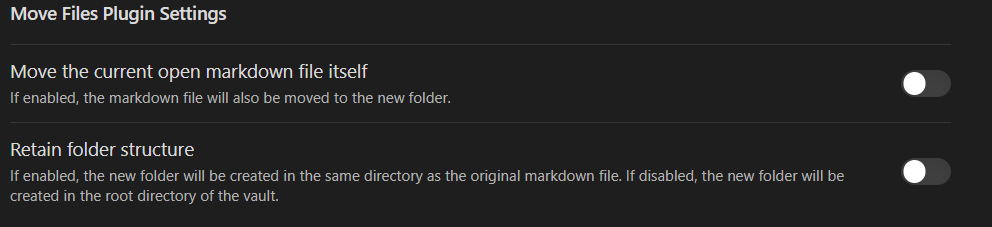

# Move Files Plugin

When editing a note, open command pallete and run 
**"Move Files Plugin: Move linked files and update links"**. 
This will create a folder with Name:
"{filename} files" and move all the linked files for e.g. png,pdf,jpg...etc to this folder. It will also udpate the links in the note.

### Updates
Version 1.2.0 : Added support/settings for retaining the folder structure while creating the new folder.
Version 1.1.0 : Added support/settings for moving the open note/md files also to the folder.

## Settings

Two settings are available:
1. Move the open note/md file as well to the folder created.
2. Retain the folder structure, folder with linked files will be created in the same path as that of the note/md file. If disabled, the folder will be created in the root directory of the vault.
 

## Example   

Run the command and all the files are moved to the folder as shown below.

  
 

## Tip

Use the https://github.com/reorx/obsidian-paste-image-rename   
plugin to automatically rename the copied images/file's as per you custom settings.

## Acknowledgement

Developed it to keep the note and their linked files organised so as to keep the vault clean and  organized.   
Inspired from the Image Collector Plugin
https://github.com/tdaykin/obsidian_image_collector  
